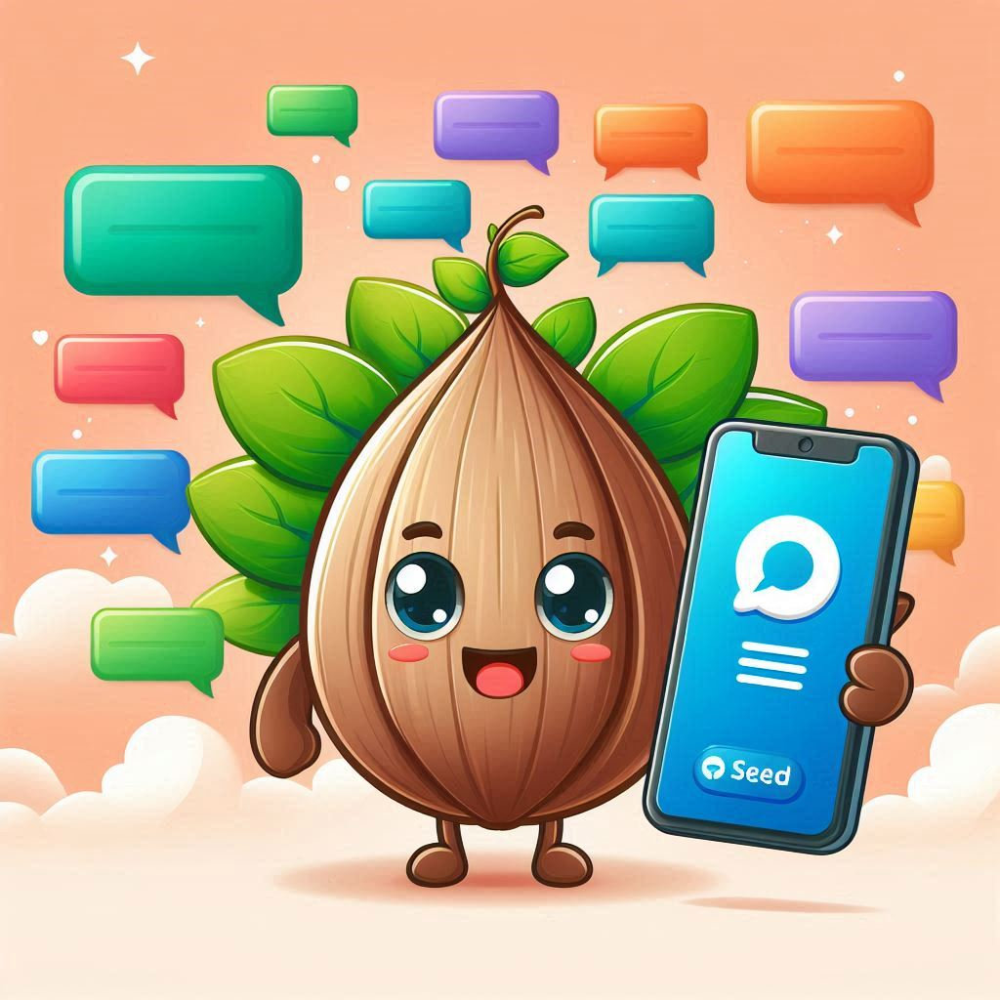
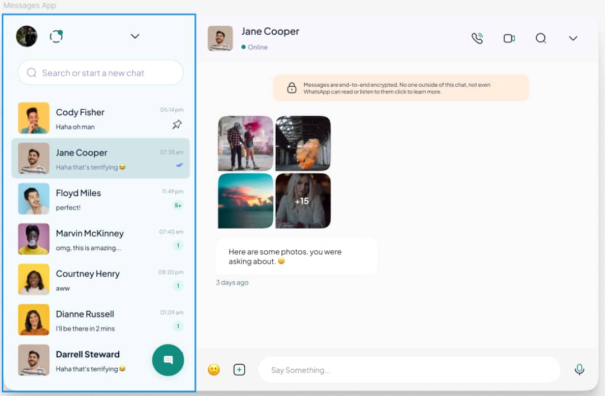

# Seed Chat

<!--  -->


**Seed Chat** is a simple, real-time web-based chat application built for fast and efficient communication. This project is designed to help users communicate in chat rooms instantly.

---

## Features

- Real-time messaging between users
- Multiple chat rooms
- Basic user authentication (login and sign-up)
- Responsive design for web

---

## Tech Stack

- **Frontend**: HTML, CSS, JavaScript
- **Backend**: Node.js, Express.js
- **Real-time Communication**: Socket.IO


---

## Installation and Setup

### Prerequisites

- [Node.js](https://nodejs.org/)
-[Socket.io](socket.io)
- [MongoDB](https://www.mongodb.com/) (optional, if using user authentication)

## Team
This project is done under the supervision of SEED Inc.
### 1. Clone the Repository

```bash
1. Clone the repository
git clone https://github.com/NJEI03/SeeDChat

```bash
2. Install all dependencies
npm install